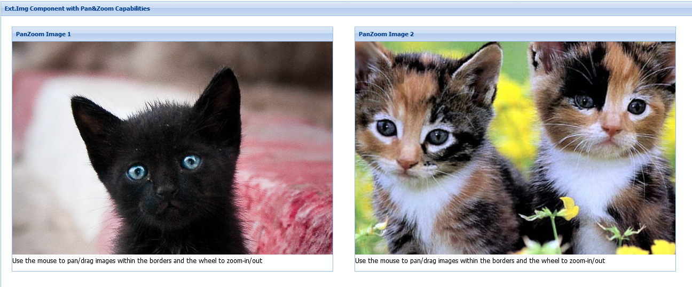

Sencha ExtJS Image component with Pan & Zoom features
-----
<br>



**Uses the Panzoom Library**

[https://github.com/timmywil/panzoom](https://github.com/timmywil/panzoom)

<br>

**Source at GitHub**

[https://github.com/wencywww/Ext.ux.PanImageComponent](https://github.com/wencywww/Ext.ux.PanImageComponent)

<br>

**Demos**

[Sencha's Fiddle: https://fiddle.sencha.com/#fiddle/3h23](https://fiddle.sencha.com/#fiddle/2o24)


<br>

**Features:**

  * Uses the Panzoom library to add pan/zoom capabilities to ExtJS Image component
  * Registers the 'panimage' / 'panimagecomponent' xtypes
  * Once instantiated, the Ext.Img underlying image can be panned with the mouse and zoomed (mouse wheel)
  * Tested with ExtJS version 5.0.0.736 and up to 6.6.0 

<br>


**Configuration options:**

  * **componentConfig** (object) - use this to provide configuration options for the Panzoom instances (see [https://github.com/timmywil/panzoom](https://github.com/timmywil/panzoom) for details)
    default is: 
    ```json
    {
      animate: true,
      maxScale: 5,
      contain: 'outside'
    }
    ```
  
  
**Usage:**

  * Include the `src/PanImage.js` file, it contains the panzoom 4.4.3 minified source (Ext must be included prior to this)
  * Instantiate the class, for example: 
    ```javascript
      var panZoomImage = Ext.create('Ext.ux.PanImageComponent', renderTo:{Ext.getBody()});
    ```
    or use 'panimage'/'panimagecomponent' xtype like so:
    ```javascript
      
      var panZoomImage = Ext.widget('panimage', {
        componentConfig: {
            maxScale: 10
          } 
      });
    ```

**List of Changes**

  * **2021-11-16**, initial commit
